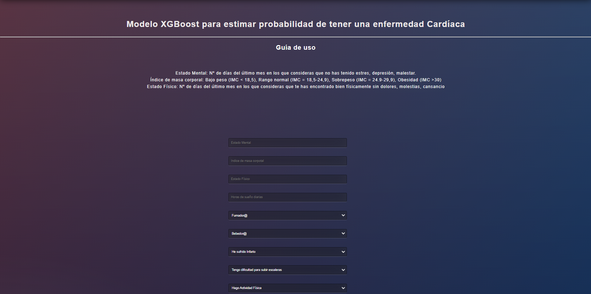

<!-- ABOUT THE PROJECT -->
## XGboost Model Web App - Heart Stroke Prediction

A partir de un dataset de marcadores personales etiquetados con presencia o no de enfermedad cardíaca. Se ha desarrollado un modelo basado en archi-conocida arquitectura XGboost para estimar la probabilidad de padecer una enfermedad del corazón.

Objetivos:
* Poner a prueba la vabilidad de modelos ML, como soporte a profesionales en medicina, para aumentar diagnósticos precoces de enfermedades que pueden comprometer la salud de un paciente.
* Desarrollo de Optimización de hiperparámetros en Modelo XgBoost
* Despliegue del modelo como servicio Web

